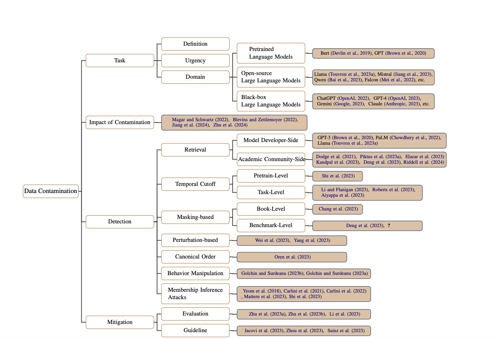

# lm-contamination-surveyy
This is the repo for ACL 2024 Finding paper - Unveiling the Spectrum of Data Contamination in Language Model: A Survey from Detection to Remediation.

A curated list of data contamination papers (Impact, Detection, Mitigation) has been collected in this repo. We welcome contributions of relevant studies not yet included and intend to update the repository regularly to reflect advancements in the field of data contamination.

## 💥 Impact 
This section aims to investigate the impact of data contamination towards downstream task performance.

1. **Data Contamination: From Memorization to Exploitation** (ACL 2022)
    [[paper](https://aclanthology.org/2022.acl-short.18/)]
2. **Language Contamination Helps Explains the Cross-lingual Capabilities of English Pretrained Models** (EMNLP 2022)
    [[paper](https://aclanthology.org/2022.emnlp-main.233/)]
3. **Investigating Data Contamination for Pre-training Language Models** (arXiv, Jan 2024)
    [[paper](https://arxiv.org/abs/2203.08242)]
4. **Critical Data Size of Language Models from a Grokking Perspective** (arXiv, Jan 2024)
    [[paper](https://arxiv.org/abs/2401.10463)]

## 🕵🏼 Detection
This section aims to explore existing methods for detecting data contamination.
### Retrieval

1. **Language Models are Few-Shot Learners** (NeurIPS 2020)
    [[paper](https://arxiv.org/abs/2005.14165)]
2. **PaLM: Scaling Language Modeling with Pathways** (JMLR 2023)
    [[paper](https://jmlr.org/papers/volume24/22-1144/22-1144.pdf)]
3. **Llama 2: Open Foundation and Fine-Tuned Chat Models** (arXiv, Jul 2023)
    [[paper](https://arxiv.org/abs/2307.09288)]
4. **Documenting Large Webtext Corpora: A Case Study on the Colossal Clean Crawled Corpus** (EMNLP 2021)
    [[paper](https://aclanthology.org/2021.emnlp-main.98/)]
5. **The ROOTS Search Tool: Data Transparency for LLMs** (ACL 2023 Demo)
    [[paper](https://aclanthology.org/2023.acl-demo.29/)]
6. **Large Language Models Struggle to Learn Long-Tail Knowledge** (ICML 2023) 
    [[paper](https://proceedings.mlr.press/v202/kandpal23a/kandpal23a.pdf)]
7. **What's In My Big Data?** (ICLR 2024)
    [[paper](https://openreview.net/forum?id=RvfPnOkPV4)]

### Temporal Cutoff
1. **Detecting Pretraining Data from Large Language Models** (ICLR 2024)
    [[paper](https://openreview.net/forum?id=zWqr3MQuNs)]
2. **Task Contamination: Language Models May Not Be Few-Shot Anymore** (AAAI 2024)
    [[paper](https://arxiv.org/abs/2312.16337)]
3. **Data Contamination Through the Lens of Time** (arXiv, Oct 2023)
    [[paper](https://arxiv.org/abs/2310.10628)]
4. **Can we trust the evaluation on ChatGPT?** (arXiv, Mar 2023)
    [[paper](https://arxiv.org/abs/2303.12767)]

### Masking-based
1. **Speak, Memory: An Archaeology of Books Known to ChatGPT/GPT-4** (EMNLP 2023)
    [[paper](https://aclanthology.org/2023.emnlp-main.453/)]
2. **Investigating Data Contamination in Modern Benchmarks for Large Language Models** (arXiv, Nov 2023)
    [[paper](https://arxiv.org/abs/2311.09783)]
3. **Testing language models for memorization of tabular data** (arXiv, Mar 2024)
    [[paper](https://arxiv.org/abs/2403.06644)]

### Perturbation-based
1. **Skywork: A More Open Bilingual Foundation Model** (arXiv, Oct 2023)
    [[paper](https://arxiv.org/abs/2310.19341)]
2. **Rethinking Benchmark and Contamination for Language Models with Rephrased Samples** (arXiv, Nov 2023)
    [[paper](https://arxiv.org/abs/2311.04850)]

### Canonical Order
1. **Proving Test Set Contamination in Black Box Language Models** (ICLR 2024)
    [[paper](https://arxiv.org/abs/2310.17623)]

### Behavior Manipulation
1. **Data Contamination Quiz: A Tool to Detect and Estimate Contamination in Large Language Models** (arXiv, Nov 2023)
    [[paper](https://arxiv.org/abs/2311.06233)]
2. **Time Travel in LLMs: Tracing Data Contamination in Large Language Models** (ICLR 2024)
    [[paper](https://openreview.net/forum?id=2Rwq6c3tvr)]

### Membership Inference Attack
1. **Privacy Risk in Machine Learning: Analyzing the Connection to Overfitting** (2018 IEEE 31st Computer Security Foundations Symposium)
   [[paper](https://arxiv.org/abs/1709.01604)]
2. **Extracting Training Data from Large Language Models** (USENIX Security 2021)
   [[paper](https://www.usenix.org/system/files/sec21-carlini-extracting.pdf)]
3. **Membership Inference Attacks From First Principles** (2022 IEEE Symposium on Security and Privacy)
   [[paper](https://arxiv.org/abs/2112.03570)]
4. **Membership Inference Attacks against Language Models via Neighbourhood Comparison** (arXiv, May 2023)
   [[paper](https://arxiv.org/abs/2305.18462)]
5. **Detecting Pretraining Data from Large Language Models** (ICLR 2024)
    [[paper](https://openreview.net/forum?id=zWqr3MQuNs)]

## 🛡️ Mitigation
This section aims to explore existing strategies for mitigating data contamination.

1. **Rethinking Benchmark and Contamination for Language Models with Rephrased Samples** (arXiv, Nov 2023)
    [[paper](https://arxiv.org/abs/2311.04850)]
2. **CLEAN-EVAL: Clean Evaluation on Contaminated Large Language Models** (arXiv, Nov 2024)
    [[paper](https://arxiv.org/abs/2311.09154)]
3. **Stop Uploading Test Data in Plain Text: Practical Strategies for Mitigating Data Contamination by Evaluation Benchmarks** (EMNLP 2023)
    [[paper](https://aclanthology.org/2023.emnlp-main.308.pdf)]
4. **LatestEval: Addressing Data Contamination in Language Model Evaluation through Dynamic and Time-Sensitive Test Construction** (AAAI 2024)
    [[paper](https://ojs.aaai.org/index.php/AAAI/article/view/29822)]
5. **Don't Make Your LLM an Evaluation Benchmark Cheater** (arXiv, Nov 2023)
    [[paper](https://arxiv.org/abs/2311.01964)]
6. **NLP Evaluation in trouble: On the Need to Measure LLM Data Contamination for each Benchmark** (EMNLP 2023 Findings)
    [[paper](https://aclanthology.org/2023.findings-emnlp.722/)]
